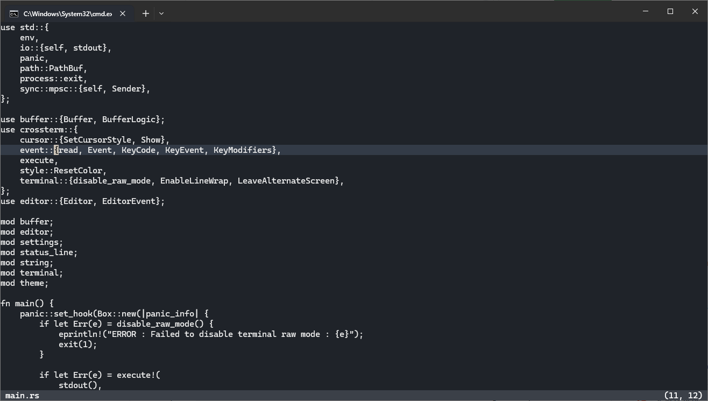

# Revo

## Milestones

- [x] Double Buffering in Terminal
- [x] Save & Save As
- [x] Basic Settings and Theme support
- [ ] Buffer Decorations
- [ ] File Explorer
- [ ] Buffer Splits
- [ ] General UX
- [ ] Code clean up + Tests

## Bugs

## Improvements

- Update `BufferData` API to be self contained. So that in the future if we decide to
  change the implementation of how we represent the data, nothing else needs to be updated.

- Update active buffer width and height on resize.