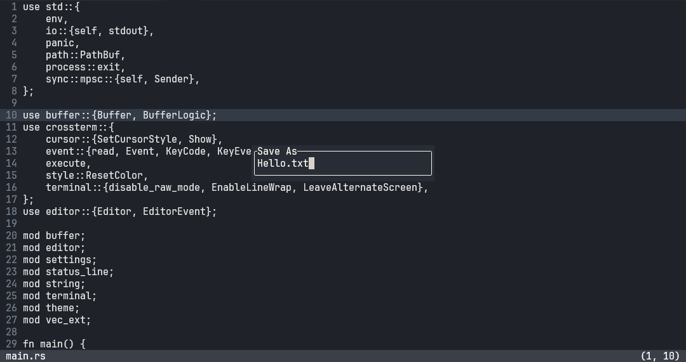
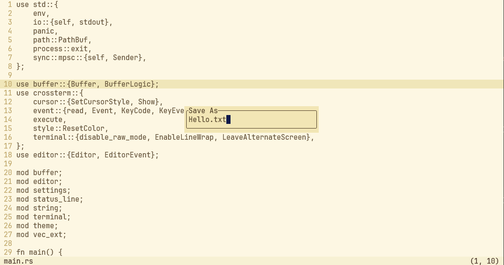

# Revo

## Milestones

- [x] Double Buffering in Terminal
- [x] Save & Save As
- [x] Basic Settings and Theme support
- [x] Buffer Decorations
- [ ] Code clean up
- [ ] Split Support
- [ ] File Explorer
- [ ] General UX
- [ ] Code clean up + Tests

## Bugs

## Improvements

- Change how we handle Focus in Editor

- Add More EditorEvents

- Update active buffer width and height on resize.

## Themes

[themes repository](https://github.com/SaumitraLohokare/revo-themes)
